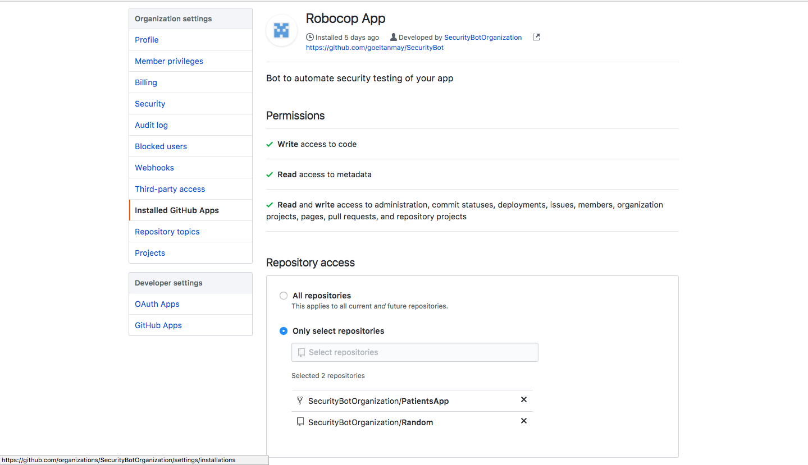
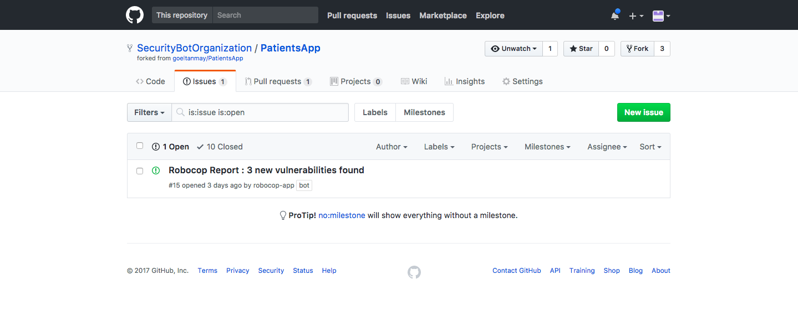
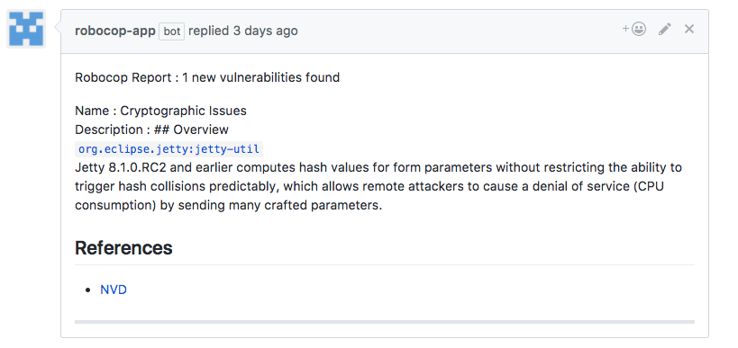
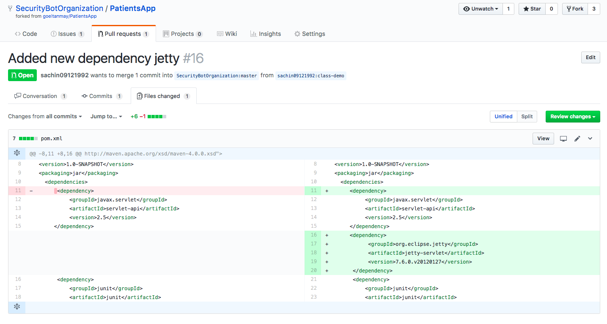
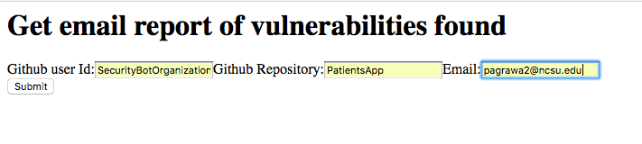
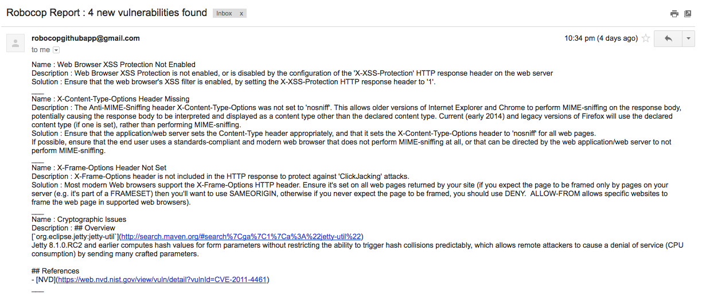

## Final Report

### Problem Statement
Data is prime commodity for any corporate. While developing an application it is responsibility of the developers to allow restricted access to data and follow proper security protocols. For example, an offshoot of Anonymous, hacktivist group Lulzsec in June 2011 hacked into Sony Pictures via SQL Injection attack and stole data that included names, passwords, e-mail and home addresses of thousands of customers. The group claimed to have compromised over one million accounts.

> >“As the world is increasingly interconnected, everyone shares the responsibility of securing cyberspace.”  
> > Newton Lee, Counterterrorism and Cybersecurity: Total Information Awareness

As the world gets online, hackers have more and more incentives to breach the security of applications on the web and obtain valuable information. Recent hacking of Equifax only goes to show that not even the biggest companies are completely secure. However, it is not the companies that are the worst hit by these hacks. The users of their products, whose details are leaked, are the ones hardest hit. As more and more personal services go online, it is imperative to secure them properly. Leak of Personal Identifiable Information is the biggest threat to consumers of these applications as it can have consequences that may not be immediately visible.

The main cause of services not being secure enough is the fact that most developers are not thinking about security when they are building these applications. This means that applications are often vulnerable to some of the oldest and easiest attacks. Things like sql-injection, cross-site scripting and CSRF attacks have been known about for quite some time now and many effective mitigation strategies have been developed to counter these attacks. However, we are seeing more and more of these attacks. Hence there is an urgent need to automatically detect if there are vulnerabilities in the code, and to correct them as soon as possible.

There are several static analysis tools and fuzzing tools to test the security of an application, however, they require the developer to be constantly running them in his workstation and keep checking for their result. We feel that an automated bot can ease this process, so that the developers can concentrate on writing code. The bot we imagine will create ‘issues’ on github repos, comment on specific lines of code which introduce a vulnerability and assign these to the developer who wrote the code.

### Use Cases

Our bot will aid users while performing the following tasks:

__1. Check security vulnerabilities of an application when bot is integrated with the repo for the first time.__

In this case, github signals the bot through installation_repositories event, which contains details of newly added repository, to check the code present in the repository against any potential vulnerabilities.

Robocop is added to a repository for the first time.

Bot fetches the code from the repository and runs OWASP ZAP and Snyk. Bot will collect the list of vulnerabilities and raise an issue with the vulnerabilities found.

List of vulnerabilities present in the repo reported by robocop.

__2. A developer wants to see all the vulnerabilities introduced in the code because of his commit.__

In this case, Robocop comments on the commit done by the developer with the vulnerabilities introduced because of it.

A developer commits a piece of code.

Github signals the bot with the push event which contains commit details. Bot fetches the code from the commit and runs OWASP ZAP and Snyk. Bot collects the list of vulnerabilities and posts a comment on the commit with the new vulnerabilities found because of it.

__3. A repo collaborator has to check a pull request for vulnerabilities.__

Our project has become big now and some outside contributor wants to suggest some changes in the code and raises a pull request for the same. Github signals the bot with the pull_request event which contains details of the pull request. Bot fetches the code from the Pull Request and runs OWASP ZAP and Snyk. Bot makes comments on the Pull Request, detailing the new vulnerabilities added because of it.

Code change done by some contributor.

  

Pull request created by the contributor.

  

Robocop comments on the pull request with the list of vulnerabilities found.

  

__4. Get recent vulnerability report via email.__

When a user needs an update about vulnerabilities present in a repository, he registers through a basic UI to request a list of vulnerabilities present via email.

After registration, bot receives an email event and send it to local instance. The event triggers local instance to query the database, fetch a list of vulnerabilities from past 5 commits and send it back to the bot. Bot now sends out an email stating the vulnerabilities found.

### Project and Development Process

We were really excited as we believed we are solving a real problem. We looked up the github app store and found that there were only 2 applications related to security, and both of them were just dependency checkers so there was definitely a space for a more comprehensive security application.

We are really excited as we believed we are solving a real problem. Most of the development work was done during the BOT milestone. The way github apps work is that there needs to be one server where github pushes the events, so we had to split our original design of one bot into 2. One was the server which communicated with github and had all the github related logic, and the local instance, which ran the different security tools and reported the results to the server.

Most of the development work was done during the BOT milestone. The way github apps work is that there needs to be one server where github pushes the events, so we had to split our original design of one bot into 2. One was the server which communicated with github and had all the github related logic, and the local instance, which ran the different security tools and reported the results to the server.

We divided ourselves into 2 teams of 2 people. Tanmay and Palak worked on the server while Jitin and Sachin worked on the local instance. We practiced pair programming, and had everyday standups during the BOT milestone, so that all the development happened in sync and both the teams were not waiting on the other.

Most of the technical hurdles were solved within the BOT milestone, and the first version was delivered. In this version, the services on the local instance were mocked, but the structure of the mocked calls was the same as actual service calls which meant that in the service milestone, we just had to switch off mocking to make our code work.

For deployment milestone, we used Ansible for the provisioning of the bot. We developed Ansible scripts which automatically hosted our server bot on Heroku instance and local instance bot on Google Compute instance.

Overall, the development process was really enjoyable for all team members. Task tracking and pair programming helped in maintaining good pace, and made sure that there was no deadline pressure as we planned the work well. We also learned technologies like node, github apis, jenkins, ansible which would definitely help us in the future.  

### Limitations and Future Work

We have structured the bot so that it is scalable and can be used by big corporations as well as small. However, one of the limitations of our work is that we only used OWASP ZAP and SNYK to find vulnerabilities. In future, we would like to include more tools like Fortify, which could do static code analysis, dynamic fuzzers to look for vulnerabilities like buffer overflow etc. One research topic could be on how to use the output of one tool to empower the second tool, so that results are more accurate and fast.

Another future work is to publish the actual bot on github. To do this, we will have to come up with a payment system, and also address concerns on whether these vulnerabilities should be displayed on github. We can have an option of privately emailing the committer or the manager.
